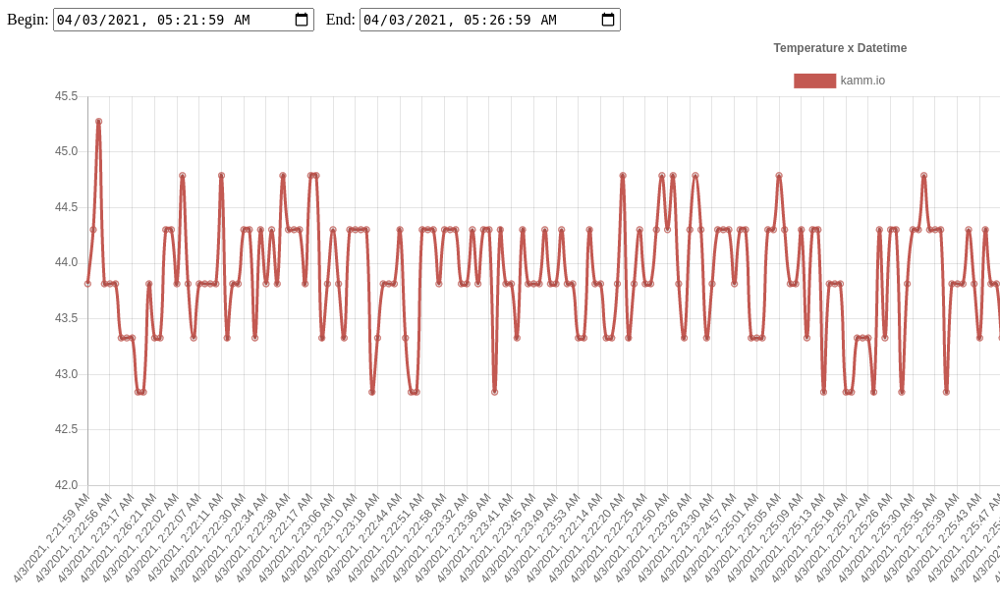

<h1 align="center">Welcome to fever-dashboard 🚒 </h1>

<p align="center">
  
</p>

## Why❓

> The idea is to use this project to study Vue 3, Vite, CompositionAPI, Chart.js and related technologies.

## Current

<p align="center">
  
</p>

## Roadmap 🗺️
This is a summary of the project goals:

- [x] Create repository and README
- [x] Choose technologies
- [x] Basic project structure 
- [x] Create an example using Chart.js
- [x] Deploy with Docker
- [x] Add it to Guardian network 
- [x] Adds axios and real call to api
- [] Think about just creating components and adding to a main dashboard

## Related
- [🔥 fever-api](https://github.com/C41949/fever-api)

## Usage

Coding
```sh
npm run i
npm run dev
```

Deploy
```sh
make dash
```

## Author

👤 **Vinicius Kammradt**

* [Website](https://kammradt.now.sh)
* [Twitter](https://twitter.com/kammzinho)
* [Github](https://github.com/kammradt)
* [LinkedIn](https://linkedin.com/in/vinicius-kammradt)

## Show your support

Give a ⭐️ if this project helped you!

***

